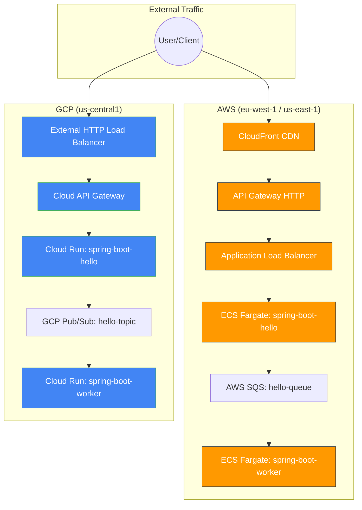

# Architecture Diagram

This document describes the multi-cloud architecture of the Spring Boot application, featuring high-availability edge layers and automated message processing.

## High-Level Overview

The application is deployed across both **AWS** and **GCP**, utilizing managed services for container orchestration, load balancing, and messaging.

## Component Details

### Edge Layers
- **AWS CloudFront**: Provides a global CDN and edge termination. Configured with a dedicated ALB backend to ensure stable routing to ECS.
- **GCP External HTTP LB**: Provides a stable global IP address and integrates with Google's edge network. Utilizes a Serverless NEG to target the Cloud API Gateway.

### API Gateways
- **AWS API Gateway**: Acts as the front door for the AWS VPC, proxying requests to the ALB.
- **GCP Cloud Gateway**: Manages API authentication and routing using an OpenAPI 2.0 definition, forwarding requests to Cloud Run.

### Compute & Messaging
- **spring-boot-hello**: The front-end service that accepts HTTP requests and publishes messages to the respective cloud messaging queues.
- **spring-boot-worker**: The back-end processor that consumes messages and performs asynchronous tasks.
- **SQS / PubSub**: Durable message brokers ensuring reliable communication between services.
