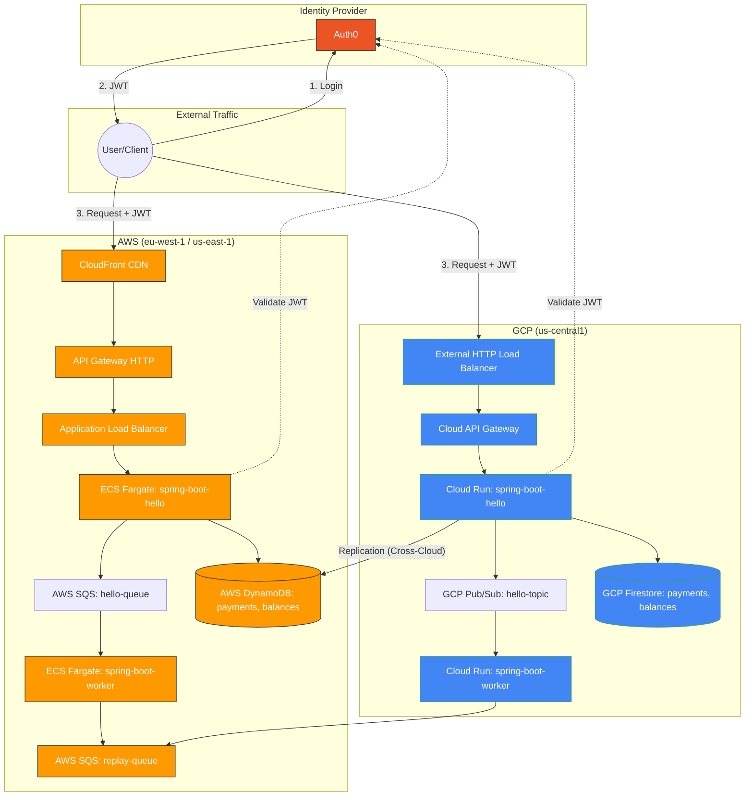

# Multi-Cloud Spring Boot Messaging

This project demonstrates a resilient, cross-cloud messaging architecture using Spring Boot, AWS (SQS/ECS), and GCP (Pub/Sub/Cloud Run). It features automated CI/CD pipelines and Infrastructure as Code (Terraform) to maintain consistent deployments across both platforms.

## Architecture Overview

The system consists of a "Hello" publisher service and a "Worker" consumer service operating in parallel on both AWS and GCP.



### Edge & Load Balancing
- **AWS**: High-availability edge termination via **CloudFront** and a dedicated **Application Load Balancer (ALB)** for stable routing to Fargate.
- **GCP**: Global traffic management via an **External HTTP Load Balancer** with **Serverless NEG** targeting the API Gateway.

## Key Features

-   **Multi-Cloud Messaging**: Implements `MessagePublisher` and `MessageConsumer` interfaces for both AWS SQS and GCP Pub/Sub using Spring Profiles (`aws`, `gcp`).
-   **Infrastructure as Code**: Full environment setup using Terraform, including VPCs, IAM roles, ECS Cluster, and Cloud Run services.
-   **Automated CI/CD**: 
    -   **AWS**: Uses CodeBuild with `buildspec.yml` to build Docker images and apply Terraform.
    -   **GCP**: Uses Cloud Build with `cloudbuild.yaml` for automated container deployments.
-   **Resiliency**: 
    -   AWS services use deployment circuit breakers for safe rollouts.
    -   `COMMIT_SHA` deployment logic ensures fresh code is always forced into production.
-   **Secure Identity**:
    -   Integrated with **Auth0** for OAuth2/OIDC authentication.
    -   Services validate JWT tokens against Auth0 JWKS.
-   **Cross-Cloud Replication**:
    -   Payments processed on GCP are continuously replicated to AWS DynamoDB to ensure data durability.

## Project Structure

-   `/spring-boot-hello`: The publisher service.
-   `/spring-boot-worker`: The consumer service.
-   `/terraform/aws`: AWS infrastructure and CodeBuild configuration.
-   `/terraform/gcp`: GCP infrastructure and Cloud Build configuration.

## Requirements

-   Java 17+
-   Terraform
-   AWS CLI (configured with appropriate profile)
-   Google Cloud SDK (configured with appropriate project)

## Local Development

Each service can be run locally by activating the relevant spring profile:

```bash
# Run with AWS SQS (requires local AWS credentials)
./mvnw spring-boot:run -Dspring-boot.run.profiles=aws

# Run with GCP Pub/Sub (requires local Google Application Credentials)
./mvnw spring-boot:run -Dspring-boot.run.profiles=gcp
```

## Deployment

Deployments are triggered automatically via Git push to the `main` branch, which initiates the respective cloud build pipelines.
